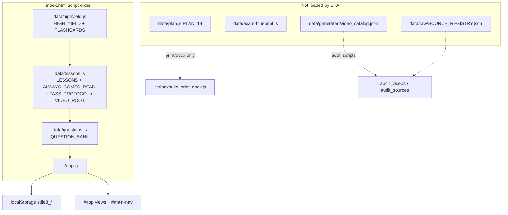
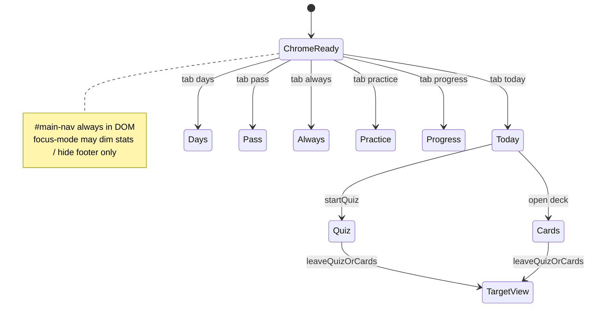
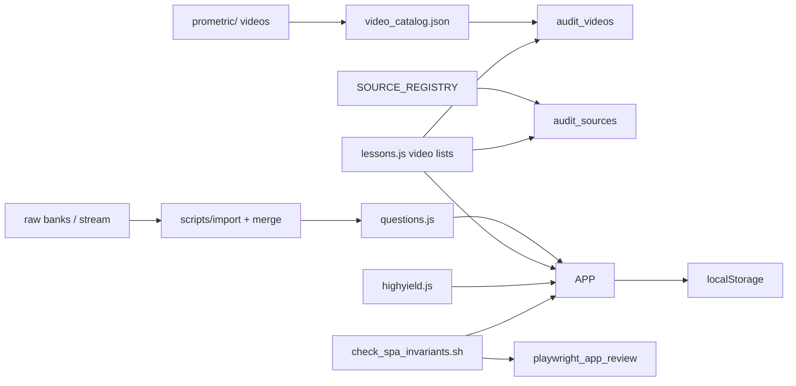

# SDLE Prep SPA — Chrome Integrity, Data Sync & Calm UI Redesign

| Field | Value |
|-------|--------|
| **Document** | Design: `sdle-prep` audit & redesign |
| **Author** | TBD |
| **Date** | 2026-07-17 |
| **Status** | Draft (rev 2 — review addressed) |
| **Codebase** | `/data/prometric/sdle-prep/` |
| **Runtime** | Static SPA · `python3 -m http.server 8765` · no build step required for core app |

---

## Overview

`sdle-prep` is a local, offline-first **KSA SDLE (Saudi Dental Licensure Examination)** study path: a 14-day plan with long in-app readings, verified video paths, flashcards, multi-block MCQ volume, Always-comes free points, pomodoro, and session history. The product audience is an ADHD learner targeting **pass ~542/800** and practice accuracy **≥80%** in ~2 weeks.

This design formalizes three fixes that already partially exist in code, and closes remaining failure modes:

1. **Chrome / navigation integrity** — main plan tabs must never disappear (focus mode once hid `.simple-nav` entirely).
2. **Data layer sync** — bank, lessons, high-yield, generated catalogs, localStorage, and pool filters must stay one coherent system with a verifiable load order and gates.
3. **Calm clinical UI** — dark navy/slate + blue/green accents (Google-ish clinical tools), not purple gradients / glass / AI pastel slop; dense volume buttons + long-form readability.

**Constraint:** remain a static SPA unless a change strongly requires otherwise. Prefer surgical CSS/JS and small audit scripts over frameworks.

---

## Background & Motivation

### Current architecture (as shipped)



| Layer | Role | Live in browser? |
|-------|------|------------------|
| `css/app.css` | Tokens, layout, focus-mode, accordion, volume grid | Yes |
| `js/app.js` (~2.2k LOC IIFE) | Nav, Today accordion, pools, quiz, cards, pomo, progress | Yes |
| `data/highyield.js` | `HIGH_YIELD`, `FLASHCARDS` | Yes |
| `data/lessons.js` | `LESSONS` (14 days), `ALWAYS_COMES_READ`, `PASS_PROTOCOL`, `VIDEO_ROOT` | Yes |
| `data/questions.js` | `QUESTION_BANK` (~2307 ids; ~2281 usable) | Yes |
| `data/plan.js` | Parallel narrative plan `PLAN_14` | **No** (print tooling) |
| `data/generated/video_catalog.json` | Disk-scanned video truth | **No** (audits) — audits remain the only automated video truth for this design horizon |
| `data/raw/SOURCE_REGISTRY.json` | Source ownership + day map gates | **No** (audits) |
| `localStorage` prefix `sdle3_` | Progress, wrong book, seenIds, history, pomo | Yes |

Playwright review (`data/generated/playwright_review/REPORT.md`, 2026-07-17): **0 FAIL**, all 6 main nav views OK, bank 2307 / usable 2281 / quarantine 26.

### Pain points that motivated this design

1. **Hidden tabs** — Focus mode previously applied `body.focus-mode .simple-nav { display: none }`. Users saw logo + stats + pomodoro only and could not reach All days / Pass / Always-comes / Extra practice / Progress without hard refresh knowledge. Partial fix is in tree; design must make regression **structurally hard** (CSS invariant + automated gates + playwright geometry asserts—not marketing “impossible”).
2. **Accordion “missing” content** — Only one step body is open; quiz volume grids live inside Step 4. Users who leave Step 1 (huge Day 1 reading) open can believe “quizzes disappeared.”
3. **Sync drift risk** — Multiple sources of truth for plan narrative (`LESSONS` vs `PLAN_14`), videos (lesson list vs `video_catalog.json`), Always-comes (rules array vs free-point MCQs vs cards merge), and offline quarantine (`usable !== false`).
4. **UI temptation** — Exam-prep apps drift toward purple/glass/pastel “AI product” chrome that hurts long reading and dense MCQ grids.
5. **Transient-view races** — `bindNav()` does not clear the quiz `timer` or unbind keys; only `#quit-quiz` / `finishQuiz` do. Navigating away mid-timed quiz can still call `finishQuiz()` in the background.

---

## Goals & Non-Goals

### Goals

- **G1.** Main plan tabs (Today, All days, Pass plan, Always-comes, Extra practice, Progress) are **always visible and labeled**, including focus mode, quiz mode, and cards mode.
- **G2.** Secondary chrome (footer, top-stats emphasis) may dim; **never** hide navigation or leave no escape from quiz/cards. Escape = existing `#quit-quiz` / `#cards-back` **plus** main tabs (no new topbar Exit control).
- **G3.** Accordion UX: clear which step is open; volume/quiz/cards never feel “missing” when collapsed; default open = first incomplete step; never zero-open.
- **G4.** Document and enforce **single sources of truth** + load order + sync verification (manual + **one** invariant script entrypoint).
- **G5.** Tokenized **calm dark UI**: WCAG-ish contrast for body text, dense ADHD-friendly volume buttons, no purple/glass slop.
- **G6.** Keep static SPA; changes reviewable as small PRs.

### Non-Goals

- Migrating to React/Vue/Vite or a backend.
- Full SRS spaced-repetition system.
- Replacing Prometric software fidelity beyond current timed mode.
- Unifying `PLAN_14` into the SPA runtime in this pass (optional later; print path stays).
- Redesigning content of Day 1 reading or bank stems (content pipeline is separate).
- Extracting `pool()` into a separate `pool.js` module this pass (document code as-is).
- Multi-open accordion as default (rejected for this pass; see Alternatives).

---

## Audit Findings

### A. Hidden / missing tabs & chrome

| Finding | Severity | Location | Status in tree | Design action |
|---------|----------|----------|----------------|---------------|
| Focus mode hid entire `.simple-nav` | **Critical (historical)** | CSS (removed) | Fixed: comment at `css/app.css` ~914–926; only footer hide + stats opacity | **Guard:** expanded hide-technique gate + playwright geometry; no `!important` unless a real conflict appears |
| Two-row topbar (brand row + full-width tabs) | Medium | `index.html` + `.topbar.simple` column flex | Present | Keep; document as invariant |
| `focusMode` hard-reset on boot | Medium | `js/app.js` init ~2216–2220 `store.set("focusMode", false)` | Recover stuck users | **Until PR1 ships:** keep hard-reset. **After PR1:** restore from store (PR3 hard-depends on PR1). Optional one-time key `sdle3_focusModeCssSafe` |
| `state.focusMode` not loaded from store (always starts `false`) | Low | `state` init ~33 | Inconsistent with `save()` writing focusMode | PR3: `focusMode: store.get("focusMode", false)` only after PR1 |
| Quiz / cards are views without tab buttons | Medium | `render()` views `quiz`, `cards` | Escape via `#quit-quiz` / `#cards-back` | **No new topbar Exit.** Wire tabs through `leaveQuizOrCards`; keep existing buttons calling the same helper |
| Nav active class duplicated ~15× via `querySelectorAll` | Low | `app.js` | Works | Centralize `setActiveNav(view)` |
| Step accordion: only open step shows body | **UX High** | `.step-body { display: none }` / `.step.open` | By design | Step strip + never-zero-open (single-open remains) |
| Click open step again collapses **all** (no body) | Medium | accordion handler ~711–718 | Can leave zero open steps | Always keep ≥1 open |
| Footer hidden in focus mode | Low | `body.focus-mode footer.foot` | OK | Keep |
| Pomodoro bar sticky under topbar | Low | `syncPomoStickyTop` | OK | Keep; resize listener already present |
| “5 menu items” copy vs **6** tabs | Medium | README + **in-app** `app.js` start-banner ~636 (`Start here — only 5 menu items`) + playwright greps that string | Live product lie | Fix copy to “6 plan tabs”; playwright **counts** `nav.simple-nav button === 6` |
| No `aria-current` on active tab | Low | `index.html` nav | A11y | Add on `setActiveNav` |

**Reachability matrix (must stay true):**

| View id | Tab label | Entry points |
|---------|-----------|--------------|
| `today` | Today | Nav, day complete flow, quiz/cards back |
| `days` | All days | Nav, `#to-days` |
| `pass` | Pass plan | Nav, deep links from Today |
| `always` | Always-comes | Nav, `#go-always` |
| `practice` | Extra practice | Nav |
| `progress` | Progress | Nav |
| `quiz` | *(no tab)* | `startQuiz` / volume buttons → exit via `#quit-quiz` or any main tab |
| `cards` | *(no tab)* | card buttons → exit via `#cards-back` or any main tab |

### B. Sync gaps between data layers

| Layer A | Layer B | Risk | Mitigation |
|---------|---------|------|------------|
| `LESSONS[].videos` | `video_catalog.json` + disk under `VIDEO_ROOT` | Lesson lists stale files | `audit_videos.py` + `SOURCE_REGISTRY` day map (audits = video truth; no runtime catalog fetch this pass) |
| `LESSONS` day packaging | `PLAN_14` in `plan.js` | Print plan ≠ in-app day titles/tasks | Document: **SPA owns LESSONS**; plan.js is print/export only OR generate plan from LESSONS later |
| `ALWAYS_COMES_READ` (lessons.js) | `HIGH_YIELD.alwaysComes` | Dual narrative of free-point rules | Prefer ALWAYS_COMES_READ for UI; highyield is mining notes; optional merge audit |
| `ALWAYS_COMES_READ` | `ensureFlashcards()` → `ac_rule_*` cards | Cards always rebuilt from rules | Document merge; don’t duplicate permanent cards with same text |
| `FLASHCARDS` (highyield.js) | Day `cardDeck` filters | Empty deck falls back to all cards | Keep fallback; show deck count on step title (already does) |
| `QUESTION_BANK` | `pool()` in `app.js` | Operative purity / multi-topic / soft-expand | **Document code as-is** (full contract below); do not invent a new filter module this pass |
| `usable: false` | Practice UI | Quarantine still in file | `allQ()` excludes; Progress can show quarantine count |
| `seenIds` / `wrongBook` / `stats.byTopic` | Unseen / Weak packs | Cold start weak → restorative, perio, endo | Document thresholds (`a >= 8`, `< 80%`) |
| Day steps `quizSets` counts | `poolN(topic)` | Button promises 50 but pool smaller | `volBtn` already clamps / shows pool meta; keep |
| Session `history` (max 80) | Progress UI | Not cross-device | Document local-only; optional export JSON later |
| Script load order | Globals | Wrong order → empty bank | Enforce order in index.html; boot assert + `check_spa_invariants.sh` |
| `exam-blueprint.js` | App | Unused by SPA | Leave offline or wire later; not required for G1–G5 |

**Bank snapshot (Playwright 2026-07-17):** 2307 total · 2281 usable · 26 quarantine · ~100 `source:always` free points · 14 lessons · ~150 cards · 55 Always-comes rules.

### C. Color / token recommendations (anti-slop)

**Keep existing `:root` hues; intentional deltas called out:**

```css
:root {
  /* Surfaces — deep slate/navy, not pure black (unchanged) */
  --bg: #0f1117;
  --bg2: #171a22;
  --bg3: #1e2330;
  --border: #2a3142;

  /* Type */
  --text: #e8eaed;
  --muted: #9aa0a6;

  /* Accents — clinical Google-ish, not neon (unchanged hues) */
  --accent: #8ab4f8;
  --accent2: #81c995;
  --warn: #fdd663;
  --danger: #f28b82;

  /* Keep --radius: 12px as shipped. 12→10 is an OPTIONAL nit in PR4 only if
     density pass wants tighter cards; not a required change. */
  --radius: 12px;
  --font: "Segoe UI", system-ui, -apple-system, sans-serif;
  --focus-ring: #8ab4f8;
}
```

**Allowed limited gradients (brand only):**

- Logo badge: `linear-gradient(135deg, #4285f4, #34a853)` — already present; keep small.
- Progress fill bars: blue→green is fine if **flat ends**, not purple rainbow.

**Forbidden (AI slop):**

- Purple / violet primary (`#7c3aed`, `#a78bfa`, indigo blobs).
- Multi-stop pastel rainbow CTAs.
- Glassmorphism: heavy `backdrop-filter` + white translucency on dark navy.
- Neon glow shadows on buttons.
- Soft pink/mint “dashboard” cards with no hierarchy.
- Animated gradient backgrounds on the topbar.

**Reading surface tokens:**

| Token use | Spec |
|-----------|------|
| Lesson body | `font-size: 1rem` (16px), `line-height: 1.6`, color `--text` or `#d8dce3` (not over-muted) |
| MCQ stem | `font-weight: 600`, high contrast |
| Volume buttons | **Keep flex layout** (see §4). Density: `min-height: 40px`, padding `10px 12px` (from current `9px 12px`), font ~0.88rem |
| Focus visible | `outline: 2px solid var(--focus-ring); outline-offset: 2px` on all interactive |

**Type scale:**

| Role | Size | Weight |
|------|------|--------|
| App title / day h1 | 1.5rem | 700 |
| Section h2 | 1.15rem | 600 |
| Lesson h3 | 1.05rem | 600 · accent |
| Lesson h4 | 0.95rem | 600 · accent2 |
| Body / options | 0.95–1rem | 400 |
| Meta / paths | 0.78–0.85rem | 400 · muted |
| Volume label | 0.88rem | 600 |
| Vol meta count | 0.72–0.75rem | 700 · chip style (existing `.vol-meta`) |

---

## Proposed Design

### 1. Chrome integrity model (nav never dies)



**Invariants (document + test):**

1. `#main-nav.simple-nav` remains in `index.html` (not re-rendered by `app.innerHTML`).
2. CSS: **no** rule under `body.focus-mode` (or any “quiet chrome” class) may hide/collapse `.simple-nav`, `.topbar`, or `#main-nav` via `display`, `visibility`, `opacity`, `height`/`max-height`, `pointer-events`, off-screen `position`/`transform`, or `clip`.
3. JS: `bindNav()` runs once at init; tab clicks call `leaveQuizOrCards` then set view.
4. Mid-quiz / mid-cards: main tabs and existing quit/back share one exit helper (below).
5. Focus toggle label: “Focus mode (tabs stay)” / “Exit focus”.

#### 1.1 Mandatory exit helper — `leaveQuizOrCards`

Current gap: `#quit-quiz` clears `timer`, `unbindQuizKeys()`, may `logSession` partial, nulls `state.quiz`. `bindNav()` only sets `state.view` + `render()` → **timed quiz can still `finishQuiz()` after navigation**.

**Contract (PR3 must implement; used by nav + `#quit-quiz` + `#cards-back` + successful finish path’s cleanup share the same unbind/clear pieces):**

```js
/**
 * Leave quiz or cards cleanly. Call before any view switch away from transient views.
 * @param {{ nextView: string, abandon?: boolean, confirmTimed?: boolean }} opts
 * @returns {boolean} false if user cancelled timed abandon
 */
function leaveQuizOrCards({ nextView, abandon = true, confirmTimed = true }) {
  // 1) Soft-confirm only if: timed quiz active AND progress unfinished
  //    (state.quiz.seconds != null / timed flag AND state.quiz.i < items.length)
  //    Recommend: confirm("Leave timed quiz? Timer will stop and answers so far may be partial.")
  // 2) if timer: clearInterval(timer); timer = null
  // 3) unbindQuizKeys(); unbindCardKeys()
  // 4) Partial log policy — MATCH existing #quit-quiz:
  //    if abandon && learn mode && learnN > 0 → logSession(... partial ...)
  //    if abandon && timed/exam mid-run → do NOT call finishQuiz() scoring path;
  //    do not invent new scoring
  // 5) state.quiz = null
  // 6) state.view = nextView; setActiveNav(mapTab(nextView)); render(); return true
}
```

| Caller | Behavior |
|--------|----------|
| `#quit-quiz` | `leaveQuizOrCards({ nextView: "today", abandon: true })` |
| `#cards-back` | `leaveQuizOrCards({ nextView: "today", abandon: true })` (unbind cards only) |
| Main tab click | `leaveQuizOrCards({ nextView: tab.dataset.view, abandon: true, confirmTimed: true })` then stop if cancelled |
| `finishQuiz` | clear timer + unbind (already); then null quiz; not “abandon” |

**PR3 acceptance:** start timed mock → click **Progress** → timer must **not** call `finishQuiz` in background; Progress must render.

**Exit chrome decision:** Prefer **no new sticky topbar Exit control**. Existing `#quit-quiz` / `#cards-back` plus always-visible main tabs are enough once the helper is solid.

#### 1.2 CSS contract (no `!important` by default)

```css
/* INVARIANT: plan tabs always visible — plain flex as shipped; do NOT add !important
   unless a real stylesheet conflict is proven in browser. */
.simple-nav {
  display: flex;
  /* never: display:none; visibility:hidden; opacity:0; height:0; max-height:0;
     pointer-events:none; transform off-screen; clip/clip-path that zeroes hit target */
}

body.focus-mode footer.foot { display: none !important; } /* existing; footer only */
body.focus-mode .top-stats { opacity: 0.55; }
/* intentionally no .simple-nav / .topbar / #main-nav hide rules under focus-mode */
```

#### 1.3 Regression gates (chrome)

**Shell / `scripts/check_spa_invariants.sh` (PR5):**

```bash
# Fail on common hide techniques targeting nav/topbar under focus-mode or globally
rg -n 'focus-mode[^{]*\{[^}]*(simple-nav|main-nav|topbar)' css/app.css && exit 1 || true
rg -n '(\.simple-nav|#main-nav)\s*\{[^}]*(display\s*:\s*none|visibility\s*:\s*hidden|opacity\s*:\s*0|pointer-events\s*:\s*none|height\s*:\s*0|max-height\s*:\s*0)' css/app.css && exit 1 || true
# index load order
rg -n 'highyield\.js' index.html | head -1
# ... assert script order highyield < lessons < questions < app.js
```

**Playwright (PR1/PR5):**

1. Load app → `document.querySelectorAll('#main-nav button').length === 6`.
2. Enable focus mode → for each button: `getBoundingClientRect().height > 0`, `visibility !== 'hidden'`, `pointer-events !== 'none'`, click still switches view.
3. Do **not** assert by grepping “5 menu” / “6 menu” strings as the sole tab count; count DOM nodes.

### 2. Accordion / step body clarity (step strip contract)

**Problem:** Only `.step.open .step-body { display: block }`. Volume UI lives in quiz step. Collapsing all steps = blank main column. `firstIncompleteKey` returns `null` when all steps done → currently **no** step open.

#### 2.1 Open-key resolution

| Condition | `openKey` |
|-----------|-----------|
| Some step incomplete | `firstIncompleteKey(L)` (existing) |
| All steps done (`firstIncompleteKey` → `null`) | Open **`always`** if present in `stepOrder`, else **last** key in `stepOrder` |
| User clicks already-open head | **Keep open** (do not collapse to zero); optional: no-op |
| User clicks different head | Close others; open clicked (single-open) |
| User marks step done | Re-render; open next incomplete (existing behavior via `renderToday`) |

#### 2.2 Step strip UI contract

**Placement:** Inside `.day-header`, **after** meta badges / ADHD toolbar, **before** the step list.

**Keys:** Follow `stepOrder(L)`: `read`, `video`, `cards`, `quiz`, optional `mock` if `L.mockType`, then `always`. **Omit mock chip** when `!L.mockType`.

**Labels (short):** Read · Videos · Cards · Quiz · Mock · Always

**HTML sketch (match existing badge colors):**

```html
<nav class="step-strip" aria-label="Day steps">
  <button type="button" class="step-chip done" data-step="read">Read</button>
  <button type="button" class="step-chip" data-step="video">Videos</button>
  <button type="button" class="step-chip open" data-step="cards" aria-current="step">Cards</button>
  <button type="button" class="step-chip" data-step="quiz">Quiz</button>
  <!-- mock only if L.mockType -->
  <button type="button" class="step-chip" data-step="always">Always</button>
</nav>
```

| Chip state | Class | Visual (reuse tokens) |
|------------|-------|------------------------|
| Done | `.step-chip.done` | green badge-like (`#1e3a2f` / `--accent2`) |
| Open | `.step-chip.open` | yellow/blue active (`#2a3a5c` / `--accent`) + `aria-current="step"` |
| Incomplete closed | `.step-chip` | muted border, `--muted` text |

**Behavior:**

- Click chip → set that step’s `.step.open` (single), scroll step head into view (`scrollIntoView({ block: "nearest" })`).
- **Not** scroll-spy (no IntersectionObserver this pass)—click-to-open only.
- Keyboard: chips are `<button>`; Tab focuses; Enter/Space activates (native).
- Mobile: `flex-wrap: wrap`; min tap target ~36–40px height.

#### 2.3 Collapsed quiz title

Enhance step title when collapsed:

`Step 4 — Practice quizzes · {allQ().length} usable · {poolSize} focus ({topic})`

so volume is advertised without opening the body.

#### 2.4 Multi-open

**Out of scope this pass** (see Alternatives Alt 5). Single-open + strip is the chosen design.

### 3. Data sync architecture

#### Single sources of truth

| Concern | Canonical owner | Consumers |
|---------|-----------------|-----------|
| MCQ stems / answers | `data/questions.js` → `QUESTION_BANK` | `allQ()`, `pool()`, quizzes |
| Quarantine | `q.usable === false` | Excluded by `allQ()`; kept for audit |
| Day curriculum (read/video/cards/quiz/mock) | `data/lessons.js` → `LESSONS` | Today, All days |
| Always-comes rules (UI list) | `LESSONS` file tail → `ALWAYS_COMES_READ` | Always tab, Today step, flashcard merge |
| Pass protocol copy | `PASS_PROTOCOL` in lessons.js | Pass tab |
| Flashcard base deck | `FLASHCARDS` in highyield.js | `ensureFlashcards()` |
| Free-point MCQ pool | `source === "always"` on bank items | `pool("always_src")` |
| Operative purity | `pool("operative")` logic in **app.js only** | Day 1 volume |
| Video filenames on disk | `data/generated/video_catalog.json` + real FS | **Audits only** this pass |
| External source ownership | `data/raw/SOURCE_REGISTRY.json` | `audit_sources.py` |
| Progress / wrong / seen | `localStorage` `sdle3_*` | Runtime only |
| Print 14-day narrative | `data/plan.js` | **docx print only** — not SPA |

#### Load order (frozen)

```html
<script src="data/highyield.js"></script>   <!-- HIGH_YIELD, FLASHCARDS -->
<script src="data/lessons.js"></script>     <!-- LESSONS, ALWAYS_COMES_READ, PASS_PROTOCOL, VIDEO_ROOT -->
<script src="data/questions.js"></script>   <!-- QUESTION_BANK -->
<script src="js/app.js"></script>           <!-- boot: assertBoot, ensureFlashcards, bindNav, render -->
```

#### Boot assertions — hard vs soft required

| Symbol | Boot level | Behavior if missing |
|--------|------------|---------------------|
| `LESSONS` | **Hard** | Fail boot; require `Array.isArray` and **`length === 14`** exactly |
| `QUESTION_BANK` | **Hard** | Fail if missing or `length < 100` |
| `ALWAYS_COMES_READ` | **Hard** | Fail if not array |
| `FLASHCARDS` | **Hard** | Fail if not array (may be empty after; `ensureFlashcards` still runs) |
| `HIGH_YIELD` | **Soft** | Warn in console; deep checklist empty on mock days |
| `PASS_PROTOCOL` | **Soft** | Pass tab uses `{}` fallbacks (already `window.PASS_PROTOCOL \|\| {}`) |
| `VIDEO_ROOT` | **Soft** | Fallback `"/data/prometric/prometric/"` in `renderToday` (already) |

```js
function assertBoot() {
  const problems = [];
  if (!Array.isArray(window.LESSONS) || window.LESSONS.length !== 14) problems.push("LESSONS (need 14 days)");
  if (!Array.isArray(window.QUESTION_BANK) || window.QUESTION_BANK.length < 100) problems.push("QUESTION_BANK");
  if (!Array.isArray(window.ALWAYS_COMES_READ)) problems.push("ALWAYS_COMES_READ");
  if (!Array.isArray(window.FLASHCARDS)) problems.push("FLASHCARDS");
  if (problems.length) {
    app.innerHTML = `<div class="alert"><strong>Data failed to load:</strong> ${problems.join(", ")}. Hard-refresh (Ctrl+Shift+R). Check script tags in index.html.</div>`;
    throw new Error("boot: " + problems.join(","));
  }
  if (!window.HIGH_YIELD) console.warn("boot: HIGH_YIELD missing (soft)");
  if (!window.PASS_PROTOCOL) console.warn("boot: PASS_PROTOCOL missing (soft)");
  if (!window.VIDEO_ROOT) console.warn("boot: VIDEO_ROOT missing; using path fallback");
}
```

Show a visible banner if hard boot fails — never a blank `#app`.

#### Pool filter contract (canonical — matches `app.js` `pool()` / helpers as-is)

**Do not invent a new filter module this pass.** PR5 docs must not diverge from this table + the code comments in `pool()`.

**Constants:**

- `allQ()` = `(QUESTION_BANK || []).filter(q => q && q.usable !== false)`
- `QUIZ_ALL = 99999` → `startQuiz` / `volBtn` treat `count >= QUIZ_ALL` as “take entire pool”
- `SUBTOPIC_KEYS` = `{ operative, fixed, implant, rpd, complete_denture, materials, restorative_general }`

**`parsePoolTopic(topic)`:**

| Input | `{ base, unseenOnly }` |
|-------|------------------------|
| `"unseen"` | `{ base: "all", unseenOnly: true }` |
| `"unseen:X"` | `{ base: "X" \|\| "all", unseenOnly: true }` |
| other | `{ base: raw, unseenOnly: false }` |

**Base branches (`pool` after `allQ()`):**

| `base` | Filter |
|--------|--------|
| `wrong` | Map `state.wrongBook` ids → questions (drop missing) |
| `always_src` | `q.source === "always"` |
| `weak` | Topics = `weakTopicKeys(3)`; filter `keys.has(q.topic)`; **sort wrongs first** in pool. Cold start (`every topic a===0` or empty pick): `["restorative","perio","endo"]`. Weak rank: practiced (`a >= 8`) & `pct < 80` worst-first, then least practiced (`a < 8`), then strong. **`startQuiz` re-sorts again:** wrongs first, then shuffle the rest — implementers must keep both. |
| `all` or empty | Keep all usable |
| contains `,` | Multi-filter: split parts. `topicSet` = parts not in SUBTOPIC_KEYS and not `unseen`/`weak`. `subSet` = parts in SUBTOPIC_KEYS. `wantUnseen` if parts includes `unseen`. Keep q if: (not wantUnseen or unseen) AND (if both sets: topicOk && subOk; if only subSet: subOk **OR** `(topic===restorative && subSet has operative && st includes operative)`; if only topicSet: topicOk) |
| `operative` | **Purity (exact):** if `source === "premium_operative"` → keep; else require `topic === "restorative"`; exclude any subtopic in `{fixed, implant, rpd, complete_denture}`; keep if subtopics include `operative` **or** `restorative_general` **or** `materials` **or** `isolation` |
| single SUBTOPIC_KEYS member | Filter `subtopics.includes(base)`. For `fixed\|implant\|rpd\|complete_denture\|materials`: if strict restorative-or-sub ≥ 15, use strict; if pool length **&lt; 20**, soft-expand by concatenating extra restorative items **without** that subtag |
| else (e.g. `perio`, `endo`, `oms`, `ortho_pedo`, `ethics`, `mixed`, `restorative`) | `q.topic === base` |

**After base:** if `unseenOnly`, drop `isSeen(q.id)`.

**`unseenTopic(base)` helper:** maps day focus → `"unseen"` or `"unseen:"+base` (if base is all/unseen/weak/wrong → `"unseen"`).

#### Sync verification approach

| Gate | Command | When |
|------|---------|------|
| **SPA invariants (entrypoint)** | `bash scripts/check_spa_invariants.sh` | Before claiming nav/sync OK; PR5 adds |
| Lesson depth | `python3 scripts/audit_lesson_depth.py` | After any reading edit |
| Videos | `python3 scripts/audit_videos.py` | After lesson video list / disk change |
| Sources master | `python3 scripts/audit_sources.py` | After registry / stream / catalog |
| Bank quality | `python3 scripts/fix_bank_quality.py` | After bank import |
| UI smoke | `node scripts/playwright_app_review.mjs` | Focus-mode geometry + tab count + timer leave |

**`check_spa_invariants.sh` contents (PR5):**

1. Expanded focus-mode / nav hide `rg` patterns (§1.3).
2. `index.html` script order: highyield → lessons → questions → app.
3. Node one-liner or python eval: load bank, assert usable count floor (e.g. ≥ 2000) and `LESSONS` not required in node if eval heavy—prefer playwright for LESSONS.
4. Invoke playwright smoke if `node`/browsers available; else skip with warn.



### 4. UI system (calm exam-prep)

**Layout:**

- Topbar: sticky, two rows — brand+stats, then full-width tabs with border-top separator (current).
- Pomodoro bar: sticky under topbar; never covers tabs.
- Main: `max-width: 820px` for reading comfort.
- Focus mode: reduce chrome noise only (footer off, stats dim).

**Volume layout decision (PR4):**

- **Keep `.volume-grid` as `display: flex; flex-wrap: wrap`** (shipped). Do **not** migrate to CSS grid in this design pass.
- Density goals via: `min-height: 40px`, padding `10px 12px`, slightly larger font if needed—surgical CSS only.
- Practice page `vol-block` composition stays flex children.

**Components hierarchy:**

1. Primary CTA: solid `--accent` border/bg `#2a3a5c` (active nav style).
2. Success volume ALL: green-tinted `.btn.success` (existing pattern).
3. Ghost: transparent + border for secondary sizes.
4. Alerts: left-border warn/success — no purple callouts.

**ADHD density:**

- Volume grids remain multi-size (50/100/150/…/ALL) with pool count chip `.vol-meta`.
- Daily goal selector stays on Today.
- Keyboard: A/B/C/D quiz; 1/2/N cards — document in muted hint (already).

**Copy fix (PR3 or PR5 — assign PR3 for in-app):**

- `app.js` start-banner: **“Start here — 6 plan tabs”** (not “only 5 menu items”).
- README table heading / “How to use” → 6 items consistently.
- Playwright: assert tab count === 6; stop treating “5 menu” as a success grep.

---

## API / Interface Changes

No HTTP APIs. Browser globals and store keys:

### Globals (window)

| Symbol | File | Boot |
|--------|------|------|
| `FLASHCARDS` | highyield.js | Hard |
| `LESSONS` | lessons.js | Hard (`length === 14`) |
| `ALWAYS_COMES_READ` | lessons.js | Hard |
| `QUESTION_BANK` | questions.js | Hard |
| `HIGH_YIELD` | highyield.js | Soft |
| `PASS_PROTOCOL` | lessons.js | Soft (`\|\| {}`) |
| `VIDEO_ROOT` | lessons.js | Soft (path fallback) |

### localStorage keys (`sdle3_` +)

| Key | Type | Notes |
|-----|------|-------|
| `day` | number 1–14 | Current day |
| `stepsDone` | `{ "1-read": true, ... }` | Per day-step |
| `dayDone` | `{ "1": true }` | Day gate |
| `stats` | `{ answered, correct, byTopic }` | Score |
| `wrongBook` | `string[]` ids | |
| `seenIds` | `{ [id]: true }` | Unseen packs |
| `cardKnown` | `{ [id]: true }` | |
| `sessionAnswered` | number | Daily Q goal progress |
| `dailyGoal` | number | default 150 |
| `focusMode` | boolean | Quiet chrome; tabs stay |
| `focusModeCssSafe` | boolean optional | One-time migration: after PR1, allow restore |
| `examQa` | object | In-lesson picks |
| `history` | array ≤80 | Session log |
| `pomoMode` / `pomoRemaining` | pomo | |
| `seenGuide` | boolean | First-run banner |

### Internal functions to treat as stable API

- Existing: `allQ()`, `pool(topic)`, `poolN(topic)`, `bankInventory()`, `startQuiz(...)`, `ensureFlashcards()`, `render()`, `unbindQuizKeys()`, `unbindCardKeys()`, `finishQuiz()`, `logSession()`.
- New: `setActiveNav(view)`, `assertBoot()`, **`leaveQuizOrCards({ nextView, abandon, confirmTimed })`**.

---

## Data Model Changes

**None required** for chrome/UI tokens.

- Do not rename `sdle3_` prefix (would wipe user progress).

**focusMode migration (resolved OQ1):**

1. **PR1 only:** keep boot hard-reset `store.set("focusMode", false)` (safe while any hide CSS risk remains).
2. **PR3 (depends on PR1):** set `store.set("focusModeCssSafe", true)` once; `state.focusMode = store.get("focusMode", false)`; stop unconditional hard-reset when `focusModeCssSafe` is true.
3. CSS must never reintroduce nav hide regardless of stored value.

---

## Alternatives Considered

### Alt 1 — Full SPA framework (React/Svelte) + Vite

| Pros | Cons |
|------|------|
| Component isolation for nav | Overkill for local static study |
| Easier state | Breaks zero-build workflow user relies on |
| | Large rewrite risk mid exam prep |

**Decision:** Reject for this design horizon.

### Alt 2 — Keep accordion; only document “click Step 4”

| Pros | Cons |
|------|------|
| Zero code | ADHD users already lost chrome once; will lose steps again |

**Decision:** Reject as sole fix; combine docs with step strip + never-zero-open.

### Alt 3 — Hide tabs in focus mode but add floating “Menu” FAB

| Pros | Cons |
|------|------|
| Maximal reading width | Reintroduces “where did nav go?” failure mode |

**Decision:** Reject. Focus mode must not remove plan tabs.

### Alt 4 — Merge plan.js into lessons.js as single plan source

| Pros | Cons |
|------|------|
| One narrative | Large content PR; print pipeline churn |

**Decision:** Defer; document dual ownership for now.

### Alt 5 — Multi-open accordion (read + quiz simultaneously)

| Pros | Cons |
|------|------|
| Day 1: read and volume buttons visible together | Long Day 1 reading + dense quiz grid = severe scroll thrash; two scroll contexts fight ADHD “one focus” |
| Fewer clicks | More complex open-state model; mobile height blow-up |

**Decision:** Reject for this pass. **Step strip + single-open** is cheaper and avoids dual-panel scroll. Revisit only if strip fails user testing.

### Alt 6 — Monolithic `check_spa_invariants.sh` vs README-only gates

| Pros of script | Cons |
|----------------|------|
| One command contributors run | Slight script maintenance |
| README-only is easy to skip | |

**Decision:** **Add the script (PR5)** as the sync/chrome verification entrypoint; README links to it. Do not rely on README snippets alone.

### Alt 7 — New sticky topbar “Exit quiz” vs tabs + existing controls

| Pros of new control | Cons |
|---------------------|------|
| Always visible mid-quiz | Extra chrome; duplicates `#quit-quiz` |

**Decision:** Reject new topbar control. Tabs + existing quit/back + `leaveQuizOrCards` is enough.

### Alt 8 — Event bus for nav active state

Overkill for six tabs. **`setActiveNav(view)`** is sufficient.

---

## Security & Privacy Considerations

| Topic | Notes |
|-------|-------|
| Threat model | Local attacker / shared machine — localStorage not encrypted |
| Auth | None; no accounts |
| Data | Study progress + wrong answers stay in browser; no telemetry in app.js |
| Scripts | `http.server` is local; do not deploy bank publicly without license review of source materials |
| XSS / trust boundary | Prefer `escapeHtml` for dynamic strings; lesson HTML is trusted author content (`L.reading` as HTML). **Invariant:** never `innerHTML` unsanitized user-entered Progress notes (none today). If PR7 export/import adds free-text fields, sanitize or use `textContent` only. |
| Clipboard | Copy video path uses Clipboard API — fine on localhost |

---

## Observability

| Signal | How |
|--------|-----|
| Boot failure | On-page alert via `assertBoot` |
| Soft missing globals | `console.warn` |
| Bank inventory | Progress + Extra practice already show pool counts |
| UI regression | `check_spa_invariants.sh` + playwright (tabs, focus geometry, timer leave) |
| Console | Playwright checks no page errors |
| Metrics | No remote metrics; optional `history` length in Progress |

**Alerting:** N/A (local app). Gate failures = exit nonzero in scripts.

---

## Rollout Plan

1. **PR1 — CSS chrome invariant** (safe).  
2. **PR2 — Accordion + step strip** (largest UX risk — manual Day 1 walkthrough required).  
3. **PR3 — Boot assert + nav helper + `leaveQuizOrCards` + copy “6 tabs”** — **hard-depends on PR1**.  
4. **PR4 — Token / density polish** (flex volume densify; radius 12→10 optional).  
5. **PR5 — `check_spa_invariants.sh` + playwright extensions + README**.

**Feature flags:** None required.

**Rollback:** Revert single file PR; localStorage schema unchanged except optional `focusModeCssSafe`.

**Definition of Done (product-wide):**

- [ ] 6 `#main-nav` buttons always visible (normal + focus mode), geometry &gt; 0, clickable  
- [ ] Playwright: focus mode screenshot or bounding-box assert  
- [ ] Day 1: step strip jumps to Quiz; collapse never leaves blank column  
- [ ] Boot failure banner when bank scripts missing  
- [ ] `check_spa_invariants.sh` green (hide-technique rg + script order)  
- [ ] Timed quiz → navigate to Progress → no background `finishQuiz`  
- [ ] In-app guide says **6 plan tabs** (not 5)  
- [ ] No purple/glass introduced in PR4  

---

## Key Decisions

1. **Static SPA stays** — User workflow and content size favor zero-build; redesign is CSS/JS/docs/gates only.  
2. **Nav is permanent chrome** — `#main-nav` outside `#app`; focus mode may not hide it; regression = expanded grep + playwright geometry (not slogans).  
3. **LESSONS + QUESTION_BANK + highyield load order is frozen** — highyield → lessons → questions → app.  
4. **SPA curriculum SoT = `lessons.js`; print SoT = `plan.js`** — avoid silent dual edits without noting drift.  
5. **`usable !== false` is the practice gate** — quarantine remains in file for audits.  
6. **Operative purity and all pool branches stay in `pool()` as documented above** — no new filter module; document code as-is (SUBTOPIC_KEYS, multi-topic commas, soft-expand &lt; 20, weak thresholds, startQuiz re-sort).  
7. **Flashcards = base deck + Always-comes merge at runtime** — `ensureFlashcards()` is canonical merge.  
8. **Calm Google-clinical palette** — keep existing navy/blue/green; ban purple/glass/pastel rainbow; **keep `--radius: 12px`** unless optional PR4 nit.  
9. **Accordion keeps single-open** + step strip + never-zero-open (all-done → open `always` or last step). Multi-open rejected this pass.  
10. **Quiz/cards are transient views** — exit only via **`leaveQuizOrCards`** shared by tabs + existing quit/back; **no new topbar Exit**.  
11. **focusMode restore only after PR1** — hard-reset until CSS-safe; PR3 hard-depends on PR1; optional `focusModeCssSafe` migration key.  
12. **Volume grid stays flex** — density via min-height/padding, not CSS grid migration.  
13. **Verification entrypoint = `scripts/check_spa_invariants.sh`** — not README-only.  
14. **Boot hard vs soft globals** — LESSONS (===14), BANK, ALWAYS_COMES_READ, FLASHCARDS hard; HIGH_YIELD / PASS_PROTOCOL / VIDEO_ROOT soft with fallbacks.

---

## Open Questions

1. ~~focusMode restore vs hard-reset~~ → **Resolved in Key Decision #11.**  
2. ~~Multi-open accordion~~ → **Resolved: no this pass (Decision #9 / Alt 5).**  
3. Generate `PLAN_14` from `LESSONS` to kill print drift? *(still open — optional PR6)*  
4. Export/import localStorage JSON for machine switch before exam? *(still open — optional PR7)*  
5. Widen main column for Extra practice only (`max-width: 960px`)? *(still open; default no)*

---

## Risks

| Risk | Severity | Mitigation |
|------|----------|------------|
| Regression re-hides nav | High | Expanded hide-technique gate + playwright geometry |
| Timer leak after tab leave | High | `leaveQuizOrCards` mandatory; PR3 acceptance test |
| Boot assert false positive | Low | Sync script load; length === 14 only for LESSONS |
| Step strip clutters mobile | Medium | Wrap chips; min height 36–40px |
| PR1/PR2 both edit `app.css` | Medium | Coordinate merge; PR2 chips in new section `.step-strip` only |
| Dual plan.js / LESSONS drift | Medium | Document; optional PR6 generator |
| PR2 rushed without Day 1 walkthrough | Medium | Manual checklist required before merge |

---

## References

- `/data/prometric/sdle-prep/README.md` — product usage  
- `/data/prometric/sdle-prep/index.html` — shell + script order  
- `/data/prometric/sdle-prep/css/app.css` — tokens, focus-mode, accordion, `.volume-grid` flex  
- `/data/prometric/sdle-prep/js/app.js` — pools, views, store, `#quit-quiz` cleanup  
- `/data/prometric/sdle-prep/data/raw/SOURCE_WORKFLOW.md` — source pipeline  
- `/data/prometric/sdle-prep/data/raw/SOURCE_REGISTRY.json` — registry  
- `/data/prometric/sdle-prep/data/generated/playwright_review/REPORT.md` — last UI gate  
- Exam targets: 200 MCQs, pass ~542/800, practice ≥80%

---

## PR Plan

### PR1 — Chrome invariant: nav never hides

- **Title:** `fix: keep main plan tabs visible in focus mode`
- **Files:** `css/app.css`; seed patterns for `scripts/check_spa_invariants.sh` (or inline comment + playwright assert)
- **Dependencies:** None  
- **CSS merge note:** Touch only focus-mode / topbar chrome rules; leave space for PR2 `.step-strip` section to avoid conflict.  
- **Changes:** CSS contract without `!important` on nav; ensure no hide techniques; playwright: enable focus mode → 6 buttons visible (height &gt; 0) and clickable.  
- **Effort:** S (~0.5 day)

### PR2 — Accordion wayfinding (step strip + never empty)

- **Title:** `UX: step strip and non-empty accordion on Today`
- **Files:** `js/app.js` (`renderToday`, accordion handlers, openKey resolution), `css/app.css` (`.step-strip` / `.step-chip` only)
- **Dependencies:** None on PR1 functionally; **coordinate CSS merge** with PR1 if parallel  
- **Changes:** Full §2 contract (chips, all-done open always/last, never zero-open, richer quiz title).  
- **Manual checklist (required before merge):**
  1. Day 1: open Step 1 (long read) → use strip to open **Quiz** → volume buttons visible without hunting.  
  2. Collapse via heads: never blank main column.  
  3. Mark all steps done → still one open (always or last).  
  4. Mobile width: chips wrap, still tappable.  
- **Effort:** M (largest UX risk; do not rush)

### PR3 — Nav/boot hygiene and transient exit

- **Title:** `Refactor: leaveQuizOrCards, setActiveNav, boot asserts, 6-tab copy`
- **Files:** `js/app.js`, `README.md` (if copy), start-banner string  
- **Dependencies:** **Hard-depends on PR1** (focusMode restore / CssSafe only after chrome invariant)  
- **Changes:**
  - Implement `leaveQuizOrCards` per §1.1; wire `bindNav`, `#quit-quiz`, `#cards-back`.  
  - `setActiveNav` + `aria-current`.  
  - `assertBoot` hard/soft table.  
  - focusMode: stop hard-reset when `focusModeCssSafe`; set that key.  
  - Copy: “6 plan tabs” in start-banner.  
  - Acceptance: timed quiz → Progress → no background finish.  
- **Effort:** M

### PR4 — Design tokens and density polish

- **Title:** `UI: calm clinical tokens, reading type scale, flex volume density`
- **Files:** `css/app.css`  
- **Dependencies:** PR1 (chrome structure stable)  
- **Changes:** Focus-visible rings; reading line-height/contrast; **flex** volume min-height/padding densify; confirm no purple/glass (current `:root` already compliant—no inventing new hues). **`--radius` 12→10 optional nit only.**  
- **Effort:** S

### PR5 — Sync documentation and verification gates

- **Title:** `Docs/gates: check_spa_invariants.sh and SoT docs`
- **Files:** `scripts/check_spa_invariants.sh` (new), `scripts/playwright_app_review.mjs`, `README.md`, cross-link `SOURCE_WORKFLOW.md`  
- **Dependencies:** PR1–PR3 for accurate acceptance  
- **Changes:** Single entrypoint script (rg hide techniques, script order, usable floor, playwright if available); document SoT + pool contract; playwright counts 6 tabs (not “5 menu” grep); focus-mode geometry; note plan.js print-only; video truth = audits.  
- **Effort:** S–M

### Optional later PRs (out of core scope)

- **PR6:** Generate print plan from `LESSONS` to eliminate `PLAN_14` drift.  
- **PR7:** localStorage export/import on Progress (respect XSS invariant).  
- **PR8:** Optional runtime `video_catalog.json` badge — **audits remain canonical video truth** even if added.

---

## Appendix: Current focus-mode CSS (post partial fix)

From `css/app.css` (approx. lines 914–926):

- Hides `footer.foot` only.
- Leaves `.path-main` max-width.
- Dims `.top-stats`.
- Comment: *“Focus mode: quiet chrome only — NEVER hide main plan tabs”*.

Init recovery in `js/app.js`:

- Forces `store.set("focusMode", false)` on boot to unstick users who saved old true + old CSS.

`#quit-quiz` (~1937–1958): clears `timer`, `unbindQuizKeys()`, optional partial `logSession` for learn mode, nulls `state.quiz`, returns to today.

These emergency measures are formalized into durable invariants, `leaveQuizOrCards`, and automated tests in this revision.
